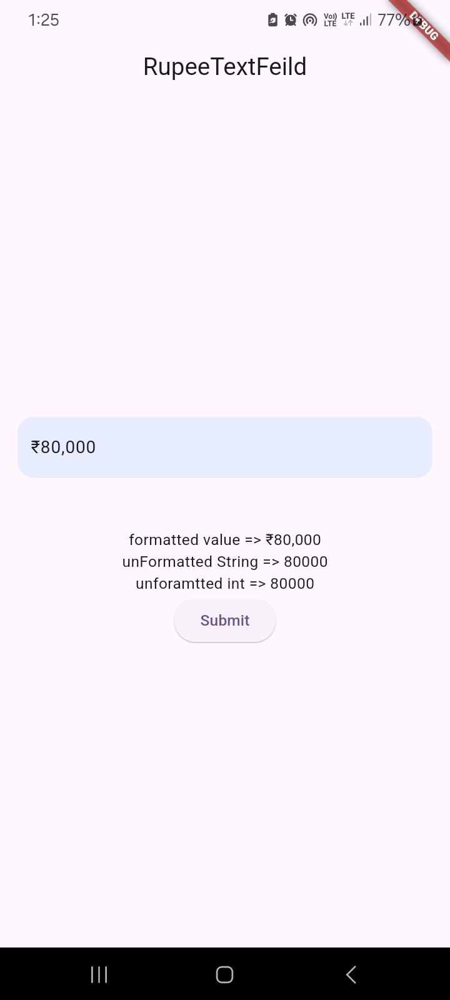

# RupeeTextField Package

The `rupee_textfield` package provides an easy way to format currency inputs in Flutter applications using `TextFormField`. It includes customization options for currency symbols and convenient string extensions for formatting and parsing currency values.

## Features

- **Currency Input Formatting**: Integrates seamlessly with `TextFormField` to format input as currency.
- **Customizable Currency Symbol**: Set and display specific currency symbols (e.g., ₹, $, €, £).
- **String Extensions**:
  - `toUnFormattedString()`: Convert a formatted currency string into a plain string.
  - `toUnFormattedInt()`: Convert a formatted currency string into an integer.

## Getting Started

To use the `rupee_textfield` package in your Flutter application, follow these steps:

1. **Add Dependency**

   Add `rupee_textfield` to your `pubspec.yaml` file:

   ```yaml
   dependencies:
     flutter:
       sdk: flutter
     rupee_textfield: ^0.0.3

2. **usage**

 Import the package and use the RupeeTextField widget in your application

 ```dart
 import 'package:rupee_textfield/rupee_textfield.dart';
 ```
    
 ```dart
  RupeeTextField(
              controller: controller,
              decoration: InputDecoration(
                  hintText: 'Enter Amount',
                  fillColor: Colors.blue.withOpacity(0.1),
                  filled: true,
                  border: const OutlineInputBorder(
                      borderSide: BorderSide.none,
                      borderRadius: BorderRadius.all(Radius.circular(15)))),
              onChanged: (value) {
                
              },
              validator: (value) {
                return value.isEmpty ? "Amount can't be empty" : null;
              },
            ),
```
3. **To get the unformatted string or integer value from the RupeeTextField controller**

```dart
  // Get the unformatted string value
String unformattedString = controller.text.toUnFormattedString(); // e.g., "80000"

// Get the unformatted integer value
int unformattedInt = controller.text.toUnFormattedInt(); // e.g., 80000
```


